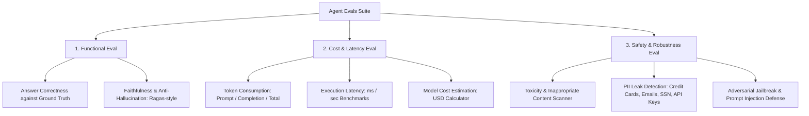

# 🤖 My Agents - Multi-Agent AI & Evaluation Suite

Welcome to **My Agents**! A modular, enterprise-grade repository of domain-specialized Agentic AI applications and a complete **3-Pillar Evaluation Framework (Evals)** built with **LangChain**, **Groq**, **Google Gemini**, **ChromaDB**, and **Streamlit**.

---

## 🌐 3-Agent Collaborative Network

| # | Agent Name | Domain & Work | Key Capabilities | Link |
|---|---|---|---|---|
| **01** | **Product Query Assistant** | E-Commerce Shopping & Specs | ChromaDB persistent long-term memory, grounding, discount rules, PDF invoices | [Explore Agent 01](./agents/01_product_query_agent/) |
| **02** | **Autonomous Web Research Agent** | Market Intelligence & Reviews | Competitor price tracking (Amazon, Best Buy, B&H), lab reviews, executive briefs | [Explore Agent 02](./agents/02_web_research_agent/) |
| **03** | **SQL & Data Analyst Agent** | Tabular Data & Financial Metrics | Read-only SQL queries, sales analytics, category revenue charts, stockout forecasting | [Explore Agent 03](./agents/03_data_analyst_agent/) |

---

## 🧪 3-Pillar Agent Evaluation Framework (`evals/`)

Our repository includes an end-to-end evaluation suite measuring every agent across 3 essential pillars:



---

## 📂 Repository Structure

```
My_Agents/
├── README.md                              # Main Hub & Documentation (You are here)
├── pyproject.toml                         # Shared dependencies & environment
├── .gitignore                             # Excludes secrets, API keys, and cache
├── .env.example                           # Global API keys template
├── app.py                                 # 🌟 Unified Streamlit Dashboard (Agents + Evals)
├── multi_agent_ecosystem_demo.ipynb       # Multi-agent collaboration notebook
├── agent_evaluations_demo.ipynb           # 3-pillar evaluation demo notebook
│
├── evals/                                 # 🧪 3-Pillar Evaluation Suite
│   ├── __init__.py
│   ├── functional_eval.py                 # Correctness & Ragas-style Faithfulness
│   ├── cost_eval.py                       # Token throughput, Latency & USD Cost
│   ├── safety_eval.py                     # Toxicity, PII Leaks & Jailbreak Defense
│   ├── benchmark_dataset.py               # Golden test cases with Ground Truth
│   └── runner.py                          # Unified EvaluationRunner & Scorecards
│
├── shared/                                # 🤝 Inter-Agent Communication & Security
│   ├── bus.py                             # AgentCommunicationBus (Pub/Sub & Delegation)
│   ├── security.py                        # SecureWorkspaceVault (Sandboxed file sharing)
│   ├── delegation_tools.py                # Cross-agent tools
│   └── orchestrator.py                    # MultiAgentNetwork Master Orchestrator
│
└── agents/
    ├── 01_product_query_agent/            # 🛍️ Agent 1: Products & ChromaDB Memory
    ├── 02_web_research_agent/             # 🔍 Agent 2: Web Research & Competitor Pricing
    └── 03_data_analyst_agent/             # 📊 Agent 3: SQL Analytics & Charts
```

---

## 🚀 Quick Start

### 1. Clone & Set Up Environment
```bash
git clone https://github.com/shivam-shukla888/My_Agents.git
cd My_Agents
cp .env.example .env
```
Add your API keys (`GROQ_API_KEY`, `GOOGLE_API_KEY`) to `.env`.

### 2. Launch the Unified Web Dashboard & Evals Suite
```powershell
$env:PYTHONPATH="src;agents/01_product_query_agent/src;agents/02_web_research_agent/src;agents/03_data_analyst_agent/src;shared;evals"
uv run streamlit run app.py
```

### 3. Run Automated Evals via Python
```python
from evals.runner import EvaluationRunner

runner = EvaluationRunner()

# Evaluate a single query
scorecard = runner.evaluate_single_interaction(
    agent_id="01_product_query_agent",
    question="What is the price and specs of MacBook Air M3?",
    ground_truth="Apple MacBook Air M3 costs $1099.00 USD with 16GB RAM and 512GB SSD."
)

print(f"Overall Grade: {scorecard['overall_grade']}")
print(f"Functional Score: {scorecard['pillar_1_functional']['score_pct']}%")
print(f"Safety Score: {scorecard['pillar_3_safety']['score_pct']}%")
print(f"Latency: {scorecard['pillar_2_cost_and_latency']['latency_seconds']}s")
```
